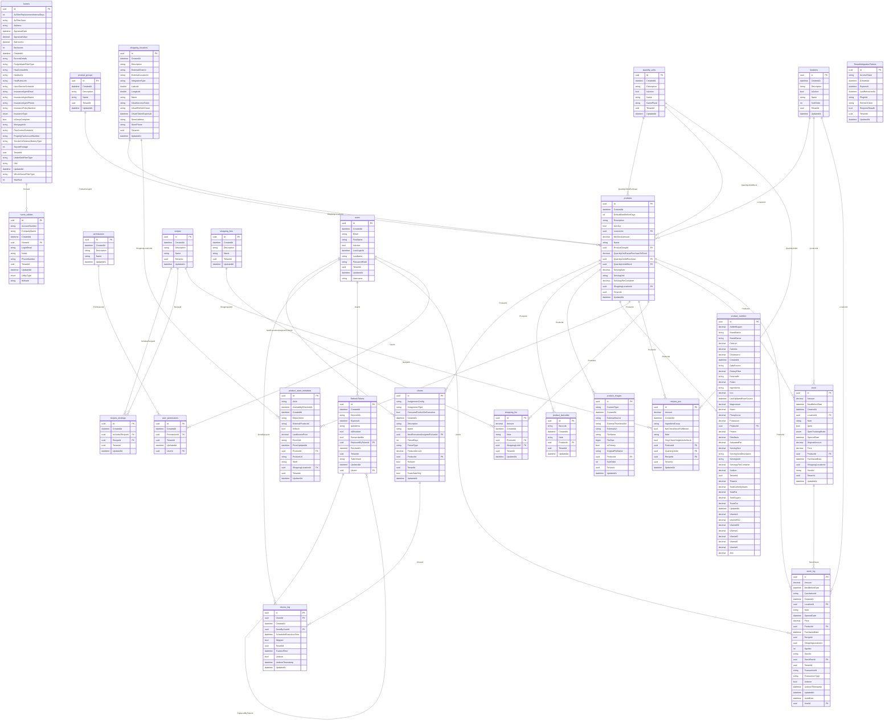

# Database Schema

```mermaid
erDiagram
    chores {
        uuid Id "PK"
        string AssignmentConfig
        string AssignmentType
        bool ConsumeProductOnExecution
        datetime CreatedAt
        string Description
        string Name
        uuid NextExecutionAssignedToUserId "FK"
        int PeriodDays
        string PeriodType
        decimal ProductAmount
        uuid ProductId "FK"
        bool Rollover
        uuid TenantId
        bool TrackDateOnly
        datetime UpdatedAt
    }
    chores_log {
        uuid Id "PK"
        uuid ChoreId "FK"
        datetime CreatedAt
        uuid DoneByUserId "FK"
        datetime ScheduledExecutionTime
        bool Skipped
        uuid TenantId
        datetime TrackedTime
        bool Undone
        datetime UndoneTimestamp
        datetime UpdatedAt
    }
    homes {
        uuid Id "PK"
        int AcFilterReplacementIntervalDays
        string AcFilterSizes
        string Address
        datetime AppraisalDate
        decimal AppraisalValue
        decimal Bathrooms
        int Bedrooms
        datetime CreatedAt
        string EscrowDetails
        string FridgeWaterFilterType
        string HoaContactInfo
        string HoaName
        string HoaRulesLink
        string HvacServiceSchedule
        string InsuranceAgentEmail
        string InsuranceAgentName
        string InsuranceAgentPhone
        string InsurancePolicyNumber
        enum InsuranceType
        bool IsSetupComplete
        string MortgageInfo
        string PestControlSchedule
        string PropertyTaxAccountNumber
        string SmokeCoDetectorBatteryType
        int SquareFootage
        uuid TenantId
        string UnderSinkFilterType
        string Unit
        datetime UpdatedAt
        string WholeHouseFilterType
        int YearBuilt
    }
    home_utilities {
        uuid Id "PK"
        string AccountNumber
        string CompanyName
        datetime CreatedAt
        uuid HomeId "FK"
        string LoginEmail
        string Notes
        string PhoneNumber
        uuid TenantId
        datetime UpdatedAt
        enum UtilityType
        string Website
    }
    locations {
        uuid Id "PK"
        datetime CreatedAt
        string Description
        bool IsActive
        string Name
        int SortOrder
        uuid TenantId
        datetime UpdatedAt
    }
    permissions {
        uuid Id "PK"
        datetime CreatedAt
        string Description
        string Name
        datetime UpdatedAt
    }
    products {
        uuid Id "PK"
        datetime CreatedAt
        int DefaultBestBeforeDays
        string Description
        bool IsActive
        uuid LocationId "FK"
        decimal MinStockAmount
        string Name
        uuid ProductGroupId "FK"
        decimal QuantityUnitFactorPurchaseToStock
        uuid QuantityUnitIdPurchase "FK"
        uuid QuantityUnitIdStock "FK"
        decimal ServingSize
        string ServingUnit
        decimal ServingsPerContainer
        uuid ShoppingLocationId "FK"
        uuid TenantId
        datetime UpdatedAt
    }
    product_barcodes {
        uuid Id "PK"
        string Barcode
        datetime CreatedAt
        string Note
        uuid ProductId "FK"
        uuid TenantId
        datetime UpdatedAt
    }
    product_groups {
        uuid Id "PK"
        datetime CreatedAt
        string Description
        string Name
        uuid TenantId
        datetime UpdatedAt
    }
    product_images {
        uuid Id "PK"
        string ContentType
        datetime CreatedAt
        string ExternalSource
        string ExternalThumbnailUrl
        string ExternalUrl
        string FileName
        bigint FileSize
        bool IsPrimary
        string OriginalFileName
        uuid ProductId "FK"
        int SortOrder
        uuid TenantId
        datetime UpdatedAt
    }
    product_nutrition {
        uuid Id "PK"
        decimal AddedSugars
        string BrandName
        string BrandOwner
        decimal Calcium
        decimal Calories
        decimal Cholesterol
        datetime CreatedAt
        string DataSource
        decimal DietaryFiber
        string ExternalId
        decimal Folate
        string Ingredients
        decimal Iron
        datetime LastUpdatedFromSource
        decimal Magnesium
        decimal Niacin
        decimal Phosphorus
        decimal Potassium
        uuid ProductId "FK"
        decimal Protein
        decimal Riboflavin
        decimal SaturatedFat
        decimal ServingSize
        string ServingSizeDescription
        string ServingUnit
        decimal ServingsPerContainer
        decimal Sodium
        uuid TenantId
        decimal Thiamin
        decimal TotalCarbohydrates
        decimal TotalFat
        decimal TotalSugars
        decimal TransFat
        datetime UpdatedAt
        decimal VitaminA
        decimal VitaminB12
        decimal VitaminB6
        decimal VitaminC
        decimal VitaminD
        decimal VitaminE
        decimal VitaminK
        decimal Zinc
    }
    product_store_metadata {
        uuid Id "PK"
        string Aisle
        datetime AvailabilityCheckedAt
        datetime CreatedAt
        string Department
        string ExternalProductId
        bool InStock
        decimal LastKnownPrice
        string PriceUnit
        datetime PriceUpdatedAt
        uuid ProductId "FK"
        string ProductUrl
        string Shelf
        uuid ShoppingLocationId "FK"
        uuid TenantId
        datetime UpdatedAt
    }
    quantity_units {
        uuid Id "PK"
        datetime CreatedAt
        string Description
        bool IsActive
        string Name
        string NamePlural
        uuid TenantId
        datetime UpdatedAt
    }
    recipes {
        uuid Id "PK"
        datetime CreatedAt
        string Description
        string Name
        uuid TenantId
        datetime UpdatedAt
    }
    recipes_nestings {
        uuid Id "PK"
        datetime CreatedAt
        uuid IncludesRecipeId "FK"
        uuid RecipeId "FK"
        uuid TenantId
        datetime UpdatedAt
    }
    recipes_pos {
        uuid Id "PK"
        decimal Amount
        datetime CreatedAt
        string IngredientGroup
        bool NotCheckStockFulfillment
        string Note
        bool OnlyCheckSingleUnitInStock
        uuid ProductId "FK"
        uuid QuantityUnitId "FK"
        uuid RecipeId "FK"
        uuid TenantId
        datetime UpdatedAt
    }
    RefreshTokens {
        uuid Id "PK"
        datetime CreatedAt
        string DeviceInfo
        datetime ExpiresAt
        string IpAddress
        bool IsRevoked
        bool RememberMe
        uuid ReplacedByTokenId "FK"
        datetime RevokedAt
        uuid TenantId
        string TokenHash
        datetime UpdatedAt
        uuid UserId "FK"
    }
    shopping_lists {
        uuid Id "PK"
        datetime CreatedAt
        string Description
        string Name
        uuid TenantId
        datetime UpdatedAt
    }
    shopping_list {
        uuid Id "PK"
        decimal Amount
        datetime CreatedAt
        string Note
        uuid ProductId "FK"
        uuid ShoppingListId "FK"
        uuid TenantId
        datetime UpdatedAt
    }
    shopping_locations {
        uuid Id "PK"
        datetime CreatedAt
        string Description
        string ExternalChainId
        string ExternalLocationId
        string IntegrationType
        double Latitude
        double Longitude
        string Name
        string OAuthAccessToken
        string OAuthRefreshToken
        datetime OAuthTokenExpiresAt
        string StoreAddress
        string StorePhone
        uuid TenantId
        datetime UpdatedAt
    }
    stock {
        uuid Id "PK"
        decimal Amount
        datetime BestBeforeDate
        datetime CreatedAt
        uuid LocationId "FK"
        string Note
        bool Open
        enum OpenTrackingMode
        datetime OpenedDate
        decimal OriginalAmount
        decimal Price
        uuid ProductId "FK"
        datetime PurchasedDate
        uuid ShoppingLocationId
        string StockId
        uuid TenantId
        datetime UpdatedAt
    }
    stock_log {
        uuid Id "PK"
        decimal Amount
        datetime BestBeforeDate
        string CorrelationId
        datetime CreatedAt
        uuid LocationId "FK"
        string Note
        datetime OpenedDate
        decimal Price
        uuid ProductId "FK"
        datetime PurchasedDate
        uuid RecipeId
        uuid ShoppingLocationId
        int Spoiled
        string StockId
        uuid StockRowId "FK"
        uuid TenantId
        string TransactionId
        string TransactionType
        bool Undone
        datetime UndoneTimestamp
        datetime UpdatedAt
        datetime UsedDate
        uuid UserId "FK"
    }
    TenantIntegrationTokens {
        uuid Id "PK"
        string AccessToken
        datetime CreatedAt
        datetime ExpiresAt
        datetime LastRefreshedAt
        string PluginId
        string RefreshToken
        bool RequiresReauth
        uuid TenantId
        datetime UpdatedAt
    }
    users {
        uuid Id "PK"
        datetime CreatedAt
        string Email
        string FirstName
        bool IsActive
        datetime LastLoginAt
        string LastName
        string PasswordHash
        uuid TenantId
        datetime UpdatedAt
        string Username
    }
    user_permissions {
        uuid Id "PK"
        datetime CreatedAt
        uuid PermissionId "FK"
        uuid TenantId
        datetime UpdatedAt
        uuid UserId "FK"
    }
    users ||--o{ chores : "NextExecutionAssignedToUserId"
    products ||--o{ chores : "ProductId"
    chores ||--o{ chores_log : "ChoreId"
    users ||--o{ chores_log : "DoneByUserId"
    homes ||--o{ home_utilities : "HomeId"
    locations ||--o{ products : "LocationId"
    product_groups ||--o{ products : "ProductGroupId"
    quantity_units ||--o{ products : "QuantityUnitIdPurchase"
    quantity_units ||--o{ products : "QuantityUnitIdStock"
    shopping_locations ||--o{ products : "ShoppingLocationId"
    products ||--o{ product_barcodes : "ProductId"
    products ||--o{ product_images : "ProductId"
    products ||--|| product_nutrition : "ProductId"
    products ||--o{ product_store_metadata : "ProductId"
    shopping_locations ||--o{ product_store_metadata : "ShoppingLocationId"
    recipes ||--o{ recipes_nestings : "IncludesRecipeId"
    recipes ||--o{ recipes_nestings : "RecipeId"
    products ||--o{ recipes_pos : "ProductId"
    quantity_units ||--o{ recipes_pos : "QuantityUnitId"
    recipes ||--o{ recipes_pos : "RecipeId"
    RefreshTokens ||--o{ RefreshTokens : "ReplacedByTokenId"
    users ||--o{ RefreshTokens : "UserId"
    products ||--o{ shopping_list : "ProductId"
    shopping_lists ||--o{ shopping_list : "ShoppingListId"
    locations ||--o{ stock : "LocationId"
    products ||--o{ stock : "ProductId"
    locations ||--o{ stock_log : "LocationId"
    products ||--o{ stock_log : "ProductId"
    stock ||--o{ stock_log : "StockRowId"
    users ||--o{ stock_log : "UserId"
    permissions ||--o{ user_permissions : "PermissionId"
    users ||--o{ user_permissions : "UserId"
```
